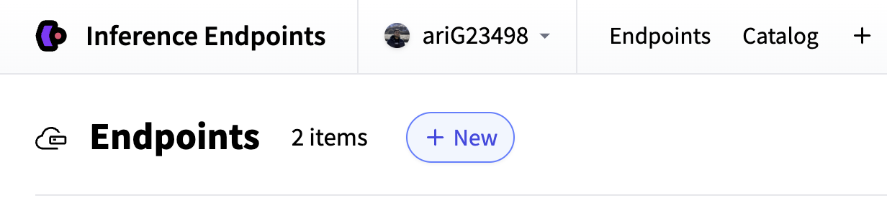
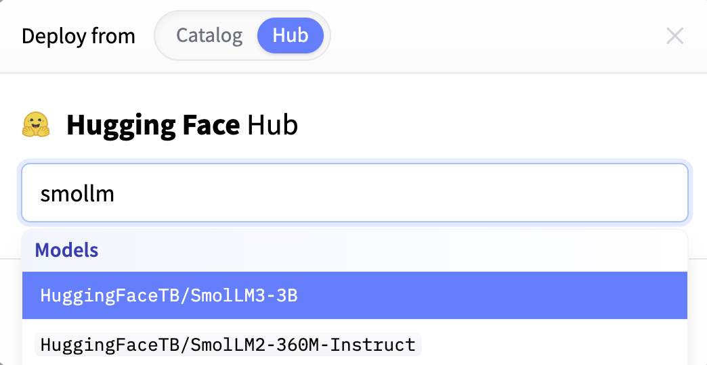
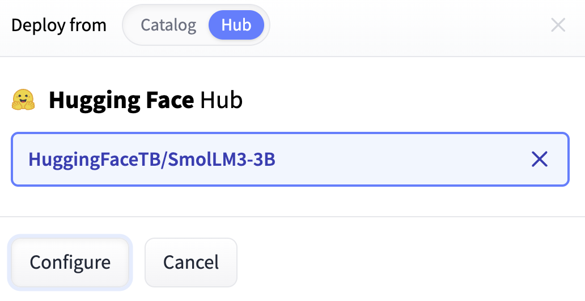
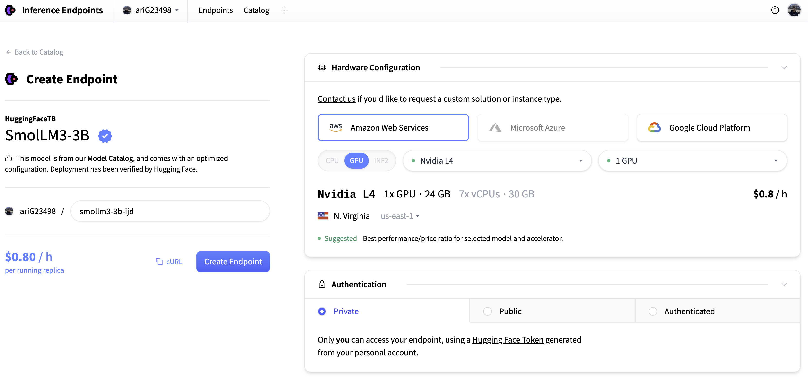
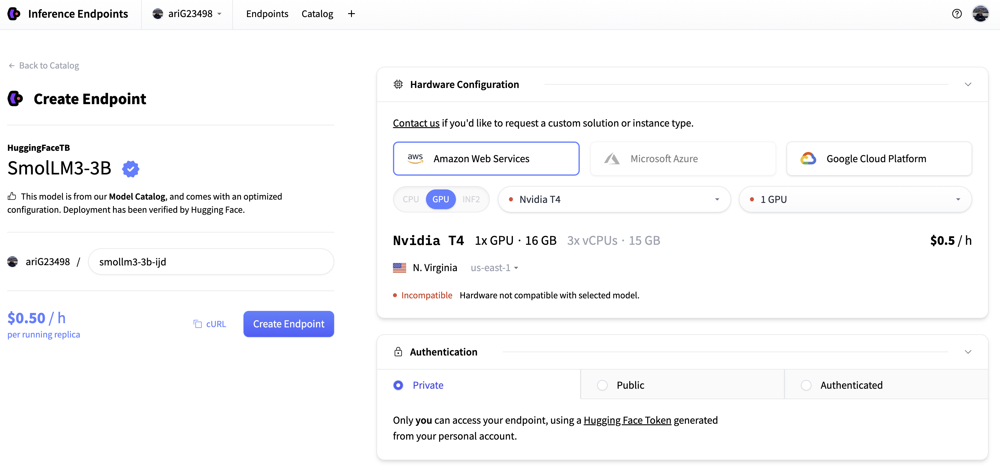
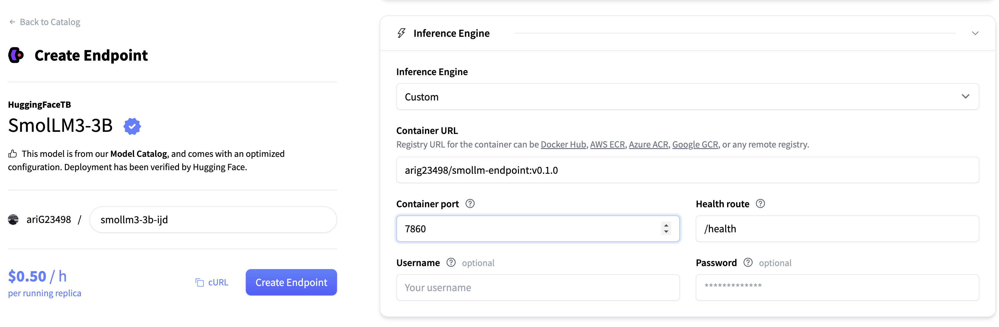
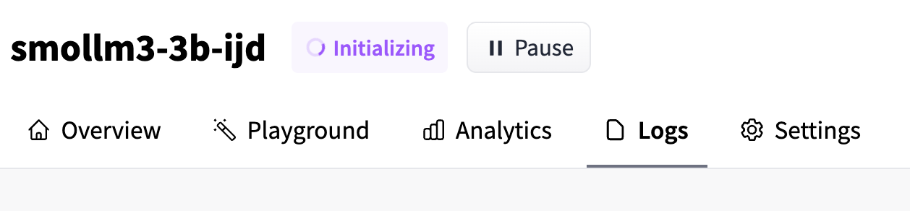
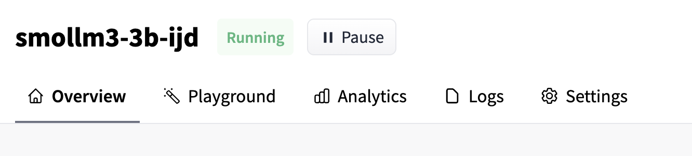
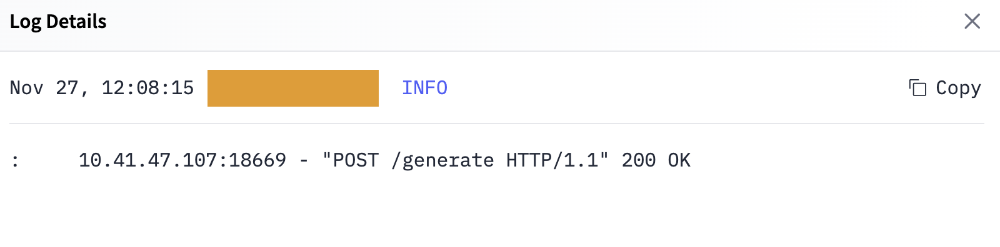

# Deploy with your own container

If you have *custom inference logic*, need *specific Python dependencies*, or expose
a *non-standard API*, pre-built Inference Engines may not be sufficient. In these cases,
you can deploy a **custom Docker container** using **Inference Endpoints**.

Inference Endpoints can run images hosted in:

* [Docker Hub](https://hub.docker.com/)
* [AWS ECR](https://aws.amazon.com/ecr/)
* [Azure ACR](https://azure.microsoft.com/de-de/services/container-registry/)
* [Google GCR](https://cloud.google.com/container-registry)

## How it works

When you deploy a custom container, Inference Endpoints acts as the orchestration layer:

1. **Image** – It pulls the Docker image you specify in the endpoint configuration.
2. **Model** – It mounts the model repository you chose in the creation form at `/repository` inside the container.
3. **Compute** – It attaches the requested CPU/GPU resources and runs your server.

Below is a step-by-step example of deploying [`HuggingFaceTB/SmolLM3-3B`](https://huggingface.co/HuggingFaceTB/SmolLM3-3B) behind a **FastAPI** server.

## 1. Create the inference server

Create a `server.py` file. This script:

* loads the model from `/repository`,
* starts a FastAPI app,
* exposes a `/health` route and a `/generate` route.

> 🚨 **Important**: The model you select when creating the endpoint is mounted at `/repository`.
> **Always load your model from `/repository`**, not directly from the Hub name.

We’ll also follow two best practices:

1. **ModelManager**
  Avoid keeping raw global model/tokenizer objects without lifecycle control.
  A small `ModelManager` class lets you:
    * lazily **load** the model onto the accelerator, and
    * safely **unload** it and free memory when the server shuts down.

2. **FastAPI lifespan**
  Use FastAPI’s `lifespan` to:
    * load the model on app startup,
    * unload the model on app shutdown.
  This keeps your container’s memory usage clean and predictable.

```python
import torch
from contextlib import asynccontextmanager
from typing import Optional

from fastapi import FastAPI
from pydantic import BaseModel
from transformers import AutoModelForCausalLM, AutoTokenizer

# ------------------------------------------------------
# Config
# ------------------------------------------------------
MODEL_ID = "/repository"
DEVICE = "cuda" if torch.cuda.is_available() else "cpu"
DTYPE = torch.bfloat16


# ------------------------------------------------------
# Model Manager
# ------------------------------------------------------
class ModelManager:
    def __init__(self, model_id: str, device: str, dtype: torch.dtype):
        self.model_id = model_id
        self.device = device
        self.dtype = dtype

        self.model: Optional[AutoModelForCausalLM] = None
        self.tokenizer: Optional[AutoTokenizer] = None

    async def load(self):
        """Load model + tokenizer if not already loaded."""
        if self.model is not None:
            return

        self.tokenizer = AutoTokenizer.from_pretrained(self.model_id)
        self.model = (
            AutoModelForCausalLM.from_pretrained(
                self.model_id,
                dtype=self.dtype,
            )
            .to(self.device)
            .eval()
        )

    async def unload(self):
        """Free model + tokenizer and clear CUDA cache."""
        if self.model is not None:
            self.model.to("cpu")
            del self.model
            self.model = None

        if self.tokenizer is not None:
            del self.tokenizer
            self.tokenizer = None

        if torch.cuda.is_available():
            torch.cuda.empty_cache()

    def get(self):
        if self.model is None or self.tokenizer is None:
            raise RuntimeError("Model not loaded")
        return self.model, self.tokenizer


model_manager = ModelManager(MODEL_ID, DEVICE, DTYPE)


# ------------------------------------------------------
# Lifespan (startup + shutdown)
# ------------------------------------------------------
@asynccontextmanager
async def lifespan(app: FastAPI):
    await model_manager.load()
    try:
        yield
    finally:
        await model_manager.unload()


app = FastAPI(lifespan=lifespan)


# ------------------------------------------------------
# Schemas
# ------------------------------------------------------
class GenerateRequest(BaseModel):
    prompt: str
    max_new_tokens: int


# ------------------------------------------------------
# Routes
# ------------------------------------------------------
@app.get("/health")
def health():
    return {"message": "API is running."}


@app.post("/generate")
def generate(request: GenerateRequest):
    model, tokenizer = model_manager.get()

    messages = [{"role": "user", "content": request.prompt}]
    input_text = tokenizer.apply_chat_template(
        messages, tokenize=False, add_generation_prompt=True
    )

    inputs = tokenizer(input_text, return_tensors="pt").to(DEVICE)

    with torch.inference_mode():
        outputs = model.generate(**inputs, max_new_tokens=request.max_new_tokens)

    generated_text = tokenizer.decode(
        outputs[0][inputs.input_ids.shape[1] :], skip_special_tokens=True
    )

    return {"response": generated_text}
```

**Notes / caveats:**

* The example assumes your model supports `apply_chat_template`. For pure CausalLMs
  without chat templates, you can pass `request.prompt` directly into the tokenizer.
* `torch.bfloat16` is a good default for modern GPUs. If you see precision or
  hardware issues, switch to `torch.float16` or `torch.float32`.
* The `/health` route is useful for debugging and readiness checks.

## 2. Build the Docker image

Now create a `Dockerfile` to package your server into a container.

> 💡 **Model weights are not baked into the image.**: Inference Endpoints will mount
> the selected model at `/repository`, so the image only needs your **code** and **Python dependencies**.

We’ll also avoid running as `root` inside the container by creating a non-root user and granting it access to `/app`.

```docker
FROM pytorch/pytorch:2.9.1-cuda12.8-cudnn9-runtime

WORKDIR /app

RUN pip install --no-cache-dir \
    transformers \
    fastapi \
    uvicorn

COPY server.py /app

RUN useradd -m -u 1000 user && \
    chown -R user:user /app

USER user

CMD ["uvicorn", "server:app", "--host", "0.0.0.0", "--port", "8000"]
```

**Notes / caveats:**

* You can pin versions for reproducibility, e.g. `transformers==4.x.x` and `fastapi==0.x.x`.
* If you add more files (e.g. utilities, configs), update `COPY` accordingly: `COPY . /app`.
* Make sure the port you use here matches what you configure (or what the platform expects) in your Inference Endpoint.

## 3. Build and Push the Image

Once your `Dockerfile` and `server.py` are ready, build the container and push it
to a registry that Hugging Face can access (Docker Hub, ECR, ACR, GCR, etc.).

```bash
docker build -t your-username/smollm-endpoint:v0.1.0 . --platform linux/amd64
docker push your-username/smollm-endpoint:v0.1.0
```

> 🤔 **Why `--platform linux/amd64`?**: Inference Endpoints run on Linux x86_64 machines.
> Building for this architecture prevents compatibility issues when building from macOS/Windows.

## 4. Create the Endpoint

Now switch to the Inference Endpoints UI and deploy your custom container.

1. Open the [Inference Endpoints dashboard](https://endpoints.huggingface.co/) and click **"+ New"**.
  

2. Select **`HuggingFaceTB/SmolLM3-3B`** as the model repository (this will be
  mounted at `/repository` inside the container).
  

3. Click **“Configure”** to proceed with the deployment setup.
  

4. This is the configuration page where you’ll define compute, networking, and container settings.
  

5. Choose the hardware.
  For this example, a **T4 GPU** is sufficient.
  

6. Under **Custom Container**, enter:
  * your image URL (e.g., `your-username/smollm-endpoint:v0.1.0`)
  * the port exposed by your container (e.g., `8000` or whatever you used in `CMD`)
    

7. Click **“Create Endpoint”**.
  The platform will:

  * pull your container image
  * mount the model at `/repository`
  * start your FastAPI server
    

8. After a short initialization period, the status will change to **Running**.
  Your custom container is now serving requests.
  

Once deployed, your endpoint will be available at a URL like:

```bash
https://random-number.region.endpoints.huggingface.cloud/
```

Below is a minimal Python client you can use to test it:

```python
from huggingface_hub import get_token
import requests

url = "https://random-number.region.endpoints.huggingface.cloud/generate"

prompt = "What is an Inference Endpoint?"
data = {"prompt": prompt, "max_new_tokens": 512}


response = requests.post(
    url=url,
    json=data,
    headers={
        "Authorization": f"Bearer {get_token()}",
        "Content-Type": "application/json",
    },
).json()

print(f"Input:\n{prompt}\n\nOutput:\n{response['response']}")

```

If you open the **Logs** tab of your endpoint, you should see the incoming POST request and the model’s response.



```
Input:
What is an Inference Endpoint?

Output:
<think>
Okay, so I need to ...
```
