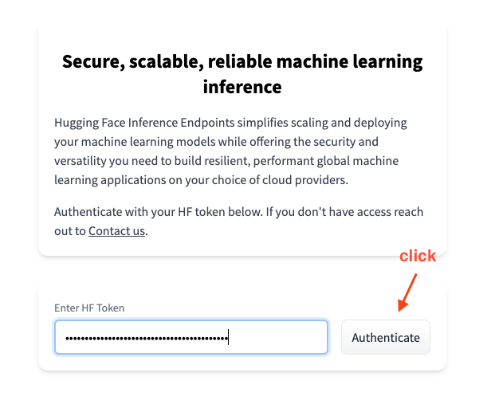
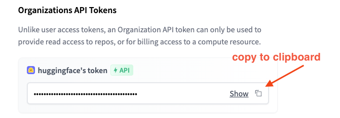

# Access the solution (UI) {#access-the-solution-ui}

To access the [🤗 Inference Endpoints web application](https://ui.endpoints.huggingface.co/), you need to authenticate using a valid Hugging Face Token as a “password”. The Hugging Face Token you use can either be your Organization Token or a personal User Token from an account that is a member of your Organization. The benefit of using your Organization Token is that you’ll collaborate with other team members since Endpoints is always associated with a Token/account (User or Organization).

1. Get your Token from [https://huggingface.co/settings/tokens](https://huggingface.co/settings/tokens) 

2. Enter your Token in [https://ui.endpoints.huggingface.co/](https://ui.endpoints.huggingface.co/) 

3. Now you can create your [first Endpoint](#create-your-first-endpoint)
