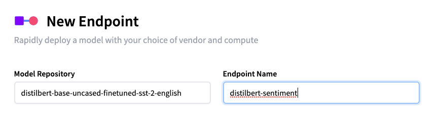
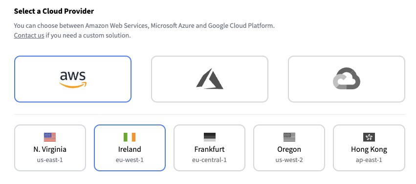
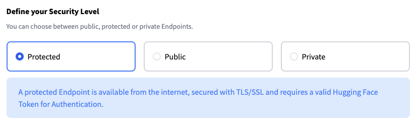
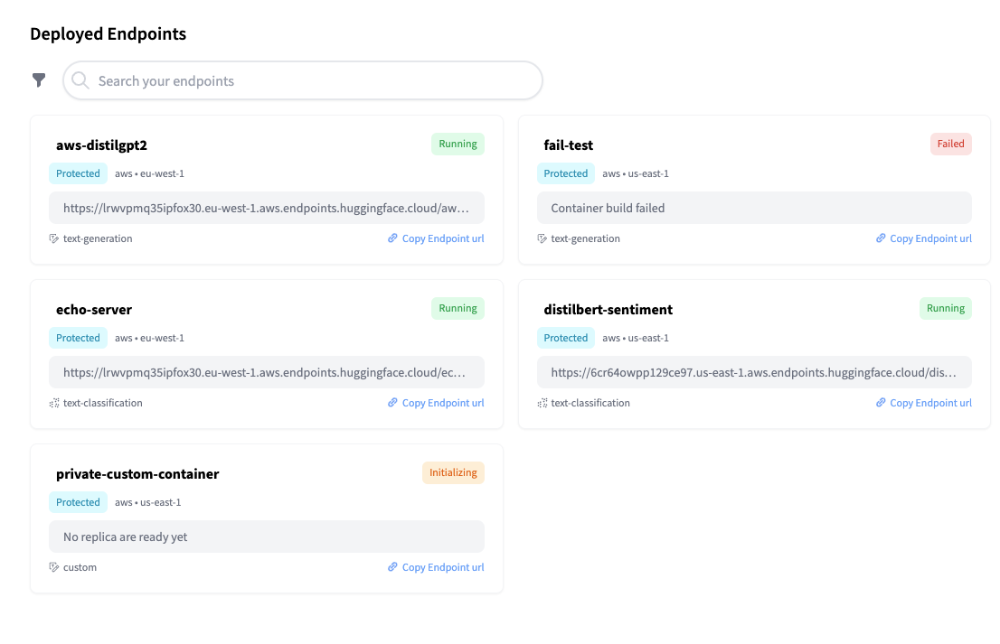

# Create your first Endpoint

After your first login, you will be directed to the [Endpoint creation page](https://ui.endpoints.huggingface.co/new). As an example, this guide will go through the steps to deploy [distilbert-base-uncased-finetuned-sst-2-english](https://huggingface.co/distilbert-base-uncased-finetuned-sst-2-english) for text classification. 

##### 1. Enter the Hugging Face Repository ID and your desired endpoint name:

##### 2. Select your Cloud Provider and Region:

_Note: Initially, only AWS will be available as a Cloud Provider, with us-east-1 and eu-west-1 Regions. We will add Azure soon. If you need to test Endpoints in other Clouds or Regions, please let us know._

##### 3. Define the [Security Level](#security-&-authentication) for the Endpoint:

##### 4. Create your Endpoint by clicking “create endpoint”: 

_Note: The cost estimate assumes the Endpoint will be up for an entire month, and does not take autoscaling into account at the time of writing._

##### 5. Wait for the Endpoint to be ready (building -> initializing -> running), which can take between 1 to 5 minutes

##### 6. Test your Endpoint in the overview, with the Inference Widget  🏁🎉!

